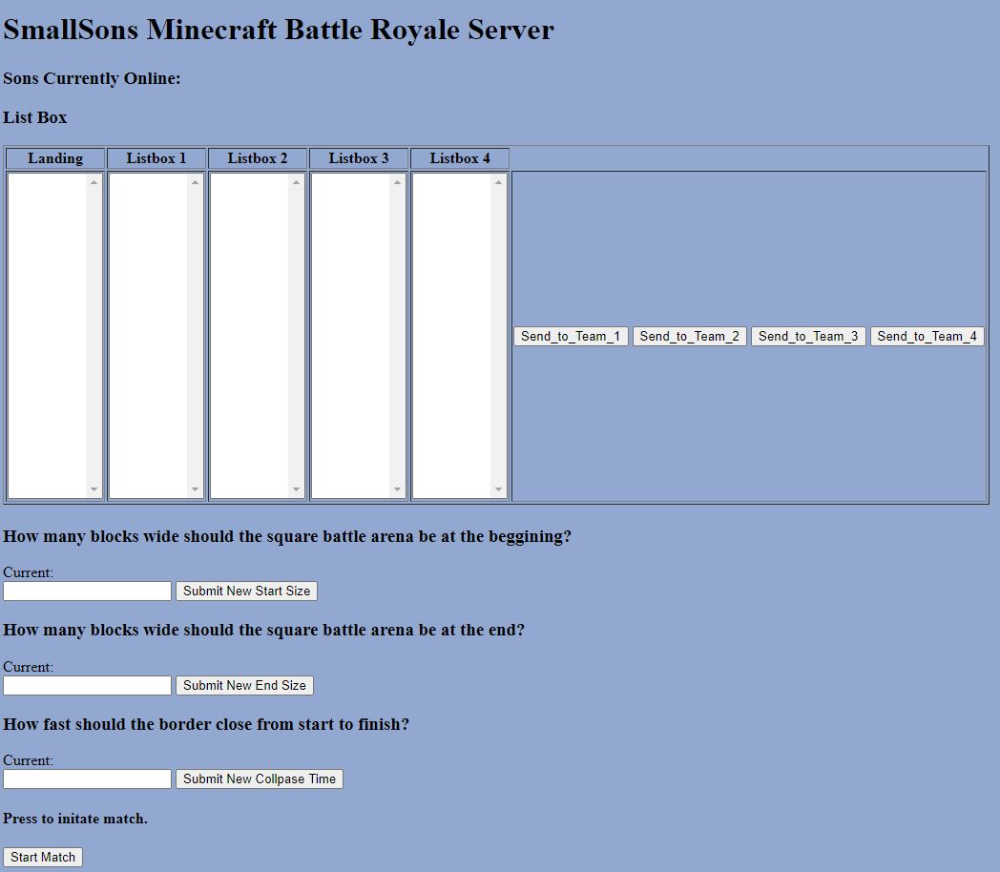
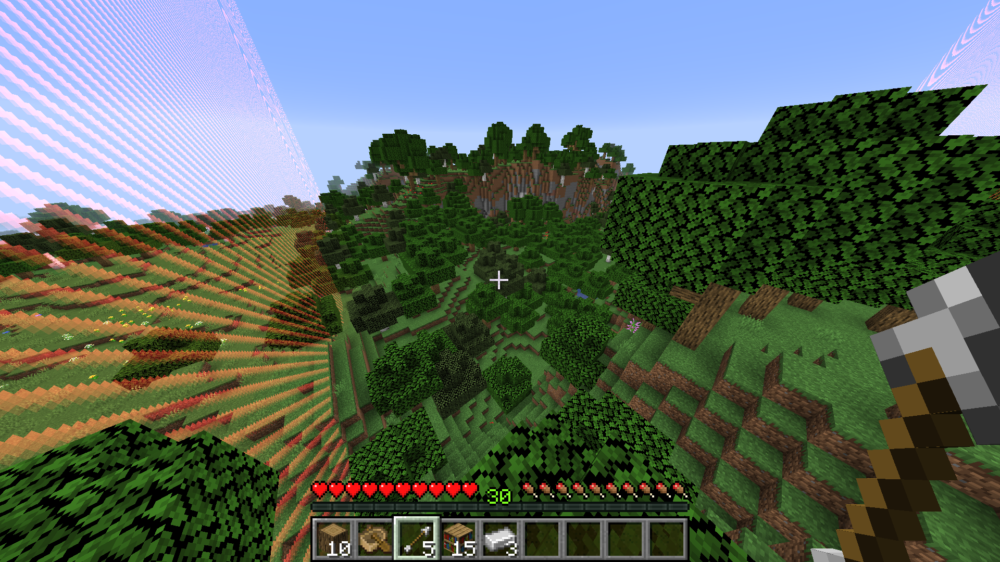
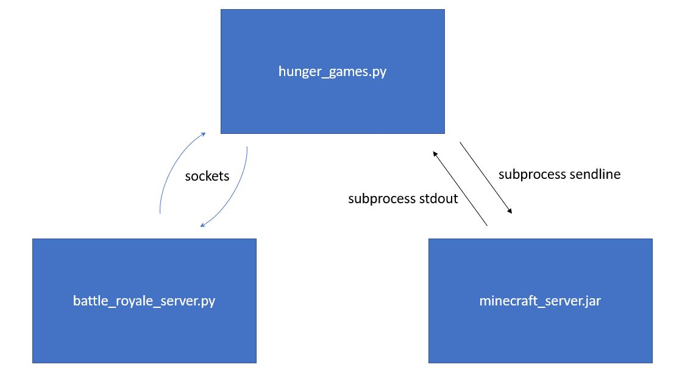

# Minecraft Battle Royale Server
A python script which uses minecraft server commands to set up battle royale style match for you and your friends. Controlled with an easy to use web interface. 

### Installing
For Windows 10. Assuming python is in your path.
Working on python 3.7.5 with minecraft 1.15.2

1. Run setup_minecraft_battle_royale.bat
2. Navigate to ./minecraft_server_1_15_2 and accept the EULA
3. Run run_server.bat

## Getting Started
You can navigate to localhost:8000 to view the web interface. Use controls to modify team composition and arena settings.

Gameplay:

## How it Works

